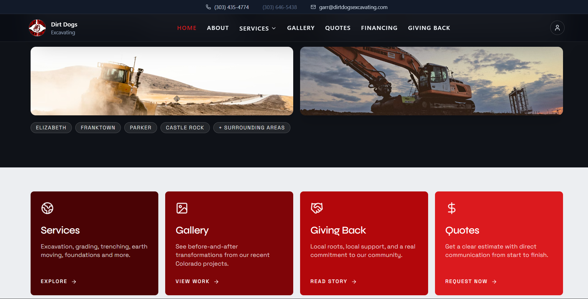

# Dirt Dogs Workspace - Excavation Website + Admin Content API

> Full-stack JavaScript workspace for a public excavation website and admin content management API, using React + Redux on the client and Express + MongoDB on the server.


-47A248)


---

## 📌 Project Overview

The frontend provides public pages for an excavation business website (Home, Services, About, Gallery, Quotes, Financing, Giving Back) plus admin screens for login, profile management, and service-detail content management. The backend provides REST endpoints under `/api` for admin and user-facing content resources such as home, about, services, blogs, galleries, testimonials, and financing.

MongoDB is used for persistent data storage through Mongoose models, and media uploads are configured through `multer-s3` with AWS S3. The backend calls `createDefaultAdmin`, `createDefaultHome`, `createDefaultAbout`, and `createDefaultCompany` on database startup to insert default records when missing.

Existing documentation in `Backend/Readme.md` references the client website URL as `https://dirtdogsexcavating.com/`. Existing `Frontend/README.md` routing and Redux notes are preserved in this merged documentation through the Routes and State Management sections below.


---

## ✨ Features

### Public Website
- Home page composed from reusable modules (`AutoSlider`, `HomeHighlights`, `Info`, `CommitmentCard`, `ServicesTestimonials`).
- Services listing page that fetches data from `/api/admin/getServiceDetailByFilter` and falls back to local mock data when needed.
- Service details page at `/services/:id` with image gallery/video rendering and admin-only edit tools.
- About page backed by `/api/users/getAbout` with fallback content.
- Gallery, Financing, Giving Back, and Quotes pages (currently use static/mock data in frontend components).

### Admin Functionality
- Admin login flow with JWT returned by backend and persisted in `localStorage`.
- Private admin routes in frontend (`/adminDashboard`, `/serviceCreate`) gated by Redux user state (`currentUser.userType === "Admin"`).
- Admin dashboard profile update form (`name`, `password`, `image`) posting multipart data to `/api/admin/updateAdminProfile`.
- Admin service creation and service-detail editing with media uploads (banners, image, video).

### Backend API & Content Management
- REST resources for Admin and User route prefixes across about, blog, service, service detail, testimonial, quote, gallery, giving back, financing, company, and home.
- Centralized async controller wrapper (`asyncHandler`) and shared error middleware.
- S3 upload/delete utilities and multer middleware for file-type + size limits.
- Upload cleanup script (`npm run cleanup:uploads`) for duplicate local upload files.

---

## 🛠️ Tech Stack

### Frontend / Client
| Technology | Version | Purpose |
|---|---|---|
| React | `^19.0.0` | UI rendering |
| React DOM | `^19.0.0` | DOM renderer |
| React Router DOM | `^7.7.1` | Client routing |
| Redux Toolkit | `^2.8.2` | State management |
| React Redux | `^9.2.0` | Redux bindings |
| React Hook Form | `^7.62.0` | Form state and validation |
| Axios | `^1.11.0` | HTTP client |
| React Toastify | `^11.0.5` | Toast notifications |
| Framer Motion | `^12.23.12` | Motion/animations |
| Lucide React | `^0.536.0` | Icon set |
| React Icons | `^5.5.0` | Icon set |
| Tailwind CSS | `^4.1.4` | Styling utility framework |
| @tailwindcss/vite | `^4.1.4` | Tailwind Vite integration |

### Backend / Server
| Technology | Version | Purpose |
|---|---|---|
| Express | `^5.1.0` | HTTP server and routing |
| Mongoose | `^8.17.0` | MongoDB ODM |
| dotenv | `^17.2.1` | Environment variable loading |
| cors | `^2.8.5` | Cross-origin policy configuration |
| morgan | `^1.10.1` | HTTP request logging |
| bcrypt | `^6.0.0` | Password hashing |
| jsonwebtoken | `^9.0.2` | JWT signing |
| multer | `^2.0.2` | Multipart form parsing |
| multer-s3 | `^3.0.1` | Direct upload to S3 via multer |
| @aws-sdk/client-s3 | `^3.1033.0` | S3 client |
| @aws-sdk/lib-storage | `^3.1033.0` | S3 upload helpers |

### Database & Storage
| Technology | Purpose |
|---|---|
| MongoDB | Primary application database (via Mongoose models) |
| AWS S3 | Media storage for uploaded images/videos |
| Local `uploads/` directory | Present in workspace; cleanup utility script exists |


---

## 📁 Project Structure

```text
project-root/
├── Backend/
│   ├── .env
│   ├── .gitignore
│   ├── AWS_S3_SETUP.md
│   ├── DEVELOPER_GUIDE.md
│   ├── S3_INTEGRATION_CHECKLIST.md
│   ├── Readme.md
│   ├── package.json
│   ├── package-lock.json
│   ├── uploads/
│   │   └── [media files]
│   └── src/
│       ├── app.js
│       ├── server.js
│       ├── config/
│       │   ├── db.js
│       │   └── s3.js
│       ├── api/
│       │   ├── controllers/
│       │   │   ├── aboutController.js
│       │   │   ├── adminController.js
│       │   │   ├── blogController.js
│       │   │   ├── companyController.js
│       │   │   ├── financingController.js
│       │   │   ├── galleryController.js
│       │   │   ├── givingController.js
│       │   │   ├── homeController.js
│       │   │   ├── quotesController.js
│       │   │   ├── serviceController.js
│       │   │   ├── servicedetailController.js
│       │   │   └── testimonialController.js
│       │   ├── middleware/
│       │   │   ├── errorMiddleware.js
│       │   │   └── multer.js
│       │   └── routes/
│       │       ├── aboutRoute.js
│       │       ├── adminRoute.js
│       │       ├── blogRoute.js
│       │       ├── companyRoute.js
│       │       ├── financingRoute.js
│       │       ├── galleryRoute.js
│       │       ├── givingRoute.js
│       │       ├── homeRoute.js
│       │       ├── quotesRoute.js
│       │       ├── serviceRoute.js
│       │       ├── servicedetailRoute.js
│       │       └── testimonialRoute.js
│       ├── models/
│       │   ├── aboutModel.js
│       │   ├── adminModel.js
│       │   ├── blogModel.js
│       │   ├── companyModel.js
│       │   ├── financingModel.js
│       │   ├── galleryModel.js
│       │   ├── givingModel.js
│       │   ├── homeModel.js
│       │   ├── quotesModel.js
│       │   ├── serviceModel.js
│       │   ├── servicedetailModel.js
│       │   └── testimonialModel.js
│       └── utils/
│           ├── asyncHandler.js
│           ├── cleanupUploads.js
│           ├── hashValue.js
│           ├── normalizePath.js
│           └── s3Upload.js
├── Frontend/
│   ├── .gitignore
│   ├── README.md
│   ├── eslint.config.js
│   ├── index.html
│   ├── package.json
│   ├── package-lock.json
│   ├── vite.config.js
│   ├── dist/
│   │   └── [build output]
│   └── src/
│       ├── App.jsx
│       ├── index.css
│       ├── main.jsx
│       ├── assets/
│       │   ├── logo.png
│       │   └── QuickBooksLogo.png
│       ├── router/
│       │   ├── AppRouter.jsx
│       │   ├── PrivateRoute.jsx
│       │   └── PublicRoute.jsx
│       ├── pages/
│       │   ├── About.jsx
│       │   ├── Financing.jsx
│       │   ├── Gallery.jsx
│       │   ├── GivingBack.jsx
│       │   ├── Home.jsx
│       │   ├── Login.jsx
│       │   ├── PageNotFound.jsx
│       │   ├── Quotes.jsx
│       │   ├── ServiceDetails.jsx
│       │   ├── Services.jsx
│       │   └── admin/
│       │       ├── AdminDashboard.jsx
│       │       └── ServiceCreate.jsx
│       ├── components/
│       │   ├── admin/
│       │   │   └── AdminShell.jsx
│       │   ├── common/
│       │   │   ├── AutoSlider.jsx
│       │   │   ├── CommitmentCard.jsx
│       │   │   ├── HomeHighlights.jsx
│       │   │   ├── Info.jsx
│       │   │   ├── ServicesTestimonials.jsx
│       │   │   └── items/
│       │   │       ├── Button.jsx
│       │   │       └── Loader.jsx
│       │   └── layout/
│       │       ├── AdminLayout.jsx
│       │       ├── Footer.jsx
│       │       ├── MainLayout.jsx
│       │       └── Navbar.jsx
│       ├── store/
│       │   └── store.js
│       ├── services/
│       │   └── axiosInstance.js
│       ├── utils/
│       │   └── getImageUrl.js
│       ├── data/
│       │   └── servicesData.js
│       └── features/
│           ├── servicesProvide/
│           │   ├── api/servicesAPI.js
│           │   ├── actions/servicesThunks.js
│           │   ├── reducers/servicesReducer.js
│           │   └── index.js
│           └── user/
│               ├── api/aboutAPI.js
│               ├── api/userAPI.js
│               ├── actions/aboutThunks.js
│               ├── actions/userThunks.js
│               ├── reducers/aboutReducer.js
│               ├── reducers/userReducer.js
│               └── index.js
└── README.md
```

---

## 🗃️ Database Models

All backend Mongoose schemas in `Backend/src/models` are created with `{ timestamps: true }`.

### Admin Schema
| Field | Type | Required | Default | Validation / Notes |
|---|---|---|---|---|
| `name` | String | No | - | `trim: true` |
| `email` | String | No | - | `trim: true` |
| `password` | String | No | - | Schema contains `trime: true` (as written in code) |
| `image` | String | No | - | Profile image URL/path |
| `userType` | String | No | `"Admin"` | `enum: ["Admin", "SubAdmin"]`, `trim: true` |

### Home Schema
| Field | Type | Required | Default | Validation / Notes |
|---|---|---|---|---|
| `topImage` | [String] | No | - | Hero image array |
| `heading` | String | No | - | `trim: true` |
| `phoneNumber` | Number | No | - | - |
| `email` | String | No | - | - |
| `homeDescription` | String | No | - | `trim: true` |
| `icon` | String | No | - | - |
| `commitment.title` | String | No | - | `trim: true` |
| `commitment.description` | String | No | - | `trim: true` |
| `homeIcon` | String | No | - | - |

### About Schema
| Field | Type | Required | Default | Validation / Notes |
|---|---|---|---|---|
| `companyHistory.title` | String | No | - | `trim: true` |
| `companyHistory.description` | String | No | - | `trim: true` |
| `customerTestimonials[].name` | String | No | - | `trim: true` |
| `customerTestimonials[].message` | String | No | - | `trim: true` |
| `commitmentToQuality.title` | String | No | - | `trim: true` |
| `commitmentToQuality.description` | String | No | - | `trim: true` |
| `loyaldogsImage` | [String] | No | - | Image URLs/paths |
| `serviceAreas` | [String] | No | - | `trim: true` |
| `ownerInfo.name` | String | No | - | `trim: true` |
| `ownerInfo.image` | String | No | - | `trim: true` |
| `ownerInfo.phone` | String | No | - | `trim: true` |
| `ownerInfo.email` | String | No | - | `trim: true` |
| `ownerInfo.address` | String | No | - | `trim: true` |

### Service Schema
| Field | Type | Required | Default | Validation / Notes |
|---|---|---|---|---|
| `title` | String | No | - | `trim: true` |
| `description` | String | No | - | `trim: true` |
| `image` | [String] | No | - | Image URLs/paths |

### Blog Schema
| Field | Type | Required | Default | Validation / Notes |
|---|---|---|---|---|
| `title` | String | No | - | `trim: true` |
| `description` | String | No | - | `trim: true` |
| `image` | [String] | No | - | Image URLs/paths |
| `recentPosts[].title` | String | No | - | `trim: true` |

### ServiceDetail Schema
| Field | Type | Required | Default | Validation / Notes |
|---|---|---|---|---|
| `title` | String | No | - | `trim: true` |
| `description` | String | No | - | `trim: true` |
| `websiteUrl` | String | No | - | `trim: true` |
| `banners` | [String] | No | - | Image URLs/paths |
| `image` | String | No | - | Card image URL/path |
| `video` | String | No | - | Video URL/path |

### Testimonial Schema
| Field | Type | Required | Default | Validation / Notes |
|---|---|---|---|---|
| `name` | String | No | - | `trim: true` |
| `message` | [String] | No | - | `trim: true` per item |

### Quote Schema
| Field | Type | Required | Default | Validation / Notes |
|---|---|---|---|---|
| `name` | String | No | - | `trim: true` |
| `phone` | String | No | - | `trim: true` |
| `email` | String | No | - | `trim: true` |
| `servicesInterestedType` | [String] | No | - | Enum list in schema: Horse Arena, Barn Pad, Driveway, Erosion Matting, Finish Grade, Road Base, Road Grading, Foundation, Sand, Trenching, Livestock Burial, Other - Explain in Notes |
| `message` | String | No | - | `trim: true` |
| `streetAddress` | String | No | - | `trim: true` |
| `city` | String | No | - | `trim: true` |
| `state` | String | No | - | `trim: true` |

### Gallery Schema
| Field | Type | Required | Default | Validation / Notes |
|---|---|---|---|---|
| `title` | String | No | - | `trim: true` |
| `description` | String | No | - | `trim: true` |
| `images[].mainImages` | String | No | - | Main image URL/path |
| `images[].subImages` | [String] | No | - | Sub-image URLs/paths |
| `galleryType` | String | No | - | Enum list in schema (service categories) |

### GivingBack Schema
| Field | Type | Required | Default | Validation / Notes |
|---|---|---|---|---|
| `title` | String | No | - | `trim: true` |
| `description` | String | No | - | `trim: true` |
| `givingType` | String | No | - | Enum list: Elizabeth High School Baseball Field, Behn Family Field in Parker Colorado, at Ponderosa High School, Daltons Moon Foundation, Kiowa Rodeo, Little League Baseball |
| `images[].mainImages` | String | No | - | Main image URL/path |
| `images[].subImages` | [String] | No | - | Sub-image URLs/paths |

### Financing Schema
| Field | Type | Required | Default | Validation / Notes |
|---|---|---|---|---|
| `title` | String | Yes | - | `trim: true` |
| `description` | String | No | - | `trim: true` |
| `icon` | String | No | - | Icon image URL/path |

### Company Schema
| Field | Type | Required | Default | Validation / Notes |
|---|---|---|---|---|
| `name` | String | No | - | `trim: true` |
| `address` | String | No | - | `trim: true` |
| `whatsappNumber` | Number | No | - | - |
| `number` | Number | No | - | - |
| `email` | String | No | - | `trim: true` |
| `about` | String | No | - | `trim: true` |
| `footerIcon` | String | No | - | `trim: true` |
| `privacyStatement` | String | No | - | `trim: true` |
| `termsOfuse` | String | No | - | `trim: true` |
| `noticeToCustomers` | String | No | - | `trim: true` |

---

## 🔌 API Reference

All route files are mounted under `/api` in `Backend/src/app.js`.

### Admin — Base: `/api/admin`
| Method | Endpoint | Description | Auth | Role |
|---|---|---|---|---|
| POST | `/api/admin/adminLogin` | Admin login by `email` + `password`; returns JWT in response data | No | Public login endpoint |
| PUT | `/api/admin/updateAdminProfile` | Update admin profile (`name`, `password`, `image` upload) using `adminId` | No | Admin route prefix |
| GET | `/api/admin/getAdmin` | Fetch admin records | No | Admin route prefix |

### Home — Base: `/api`
| Method | Endpoint | Description | Auth | Role |
|---|---|---|---|---|
| GET | `/api/admin/getHomePage` | Fetch home content plus attached blog/quote/service/gallery/giving/testimonial data | No | Admin route prefix |
| GET | `/api/users/getHomePage` | Same home fetch for user path | No | User route prefix |
| PUT | `/api/admin/updateHomePage` | Update home content; accepts `topImage` and `homeIcon` uploads | No | Admin route prefix |

### About — Base: `/api`
| Method | Endpoint | Description | Auth | Role |
|---|---|---|---|---|
| GET | `/api/admin/getAbout` | Fetch about content | No | Admin route prefix |
| GET | `/api/users/getAbout` | Fetch about content | No | User route prefix |
| PUT | `/api/admin/updateAbout` | Update about content and optional `loyaldogsImage` / `ownerImage` uploads | No | Admin route prefix |
| GET | `/api/users/getAboutById` | Fetch about record by `aboutId` query | No | User route prefix |
| GET | `/api/admin/getAboutById` | Fetch about record by `aboutId` query | No | Admin route prefix |
| DELETE | `/api/admin/deleteAbout` | Delete full about record or selected nested items via indexes | No | Admin route prefix |

### Service — Base: `/api`
| Method | Endpoint | Description | Auth | Role |
|---|---|---|---|---|
| POST | `/api/admin/createService` | Create service (`title`, `description`, `image` upload array) | No | Admin route prefix |
| PUT | `/api/admin/updateService` | Update service by `serviceId`; replace/add images via `imageIndexes` | No | Admin route prefix |
| GET | `/api/admin/getServiceById` | Fetch service by `serviceId` | No | Admin route prefix |
| DELETE | `/api/admin/deleteService` | Delete full service or selected images by indexes | No | Admin route prefix |
| GET | `/api/admin/getServiceByFilter` | Filter services (search); returns latest match | No | Admin route prefix |
| GET | `/api/users/getServiceByFilter` | Filter services for user path | No | User route prefix |
| GET | `/api/users/getServiceById` | Fetch service by ID for user path | No | User route prefix |

### Blog — Base: `/api`
| Method | Endpoint | Description | Auth | Role |
|---|---|---|---|---|
| POST | `/api/admin/createBlog` | Create blog with `image` upload(s) and optional `recentPosts` JSON | No | Admin route prefix |
| PUT | `/api/admin/updateBlog` | Update blog fields/media and `recentPosts` entries | No | Admin route prefix |
| DELETE | `/api/admin/deleteBlog` | Delete full blog or selected images/recent posts by indexes | No | Admin route prefix |
| GET | `/api/admin/getBlogById` | Fetch blog by `blogId` | No | Admin route prefix |
| GET | `/api/users/getBlogById` | Fetch blog by `blogId` | No | User route prefix |
| GET | `/api/admin/getBlogByFilter` | Paginated blog filter endpoint (`search`, `page`, `limit`) | No | Admin route prefix |
| GET | `/api/users/getBlogByFilter` | User path for paginated blog filter | No | User route prefix |

### Service Detail — Base: `/api`
| Method | Endpoint | Description | Auth | Role |
|---|---|---|---|---|
| POST | `/api/admin/createServiceDetail` | Create service detail with `banners`, `image`, `video` uploads | No | Admin route prefix |
| PUT | `/api/admin/updateServiceDetail` | Update service detail by `serviceDetailId`; supports media replacement/index targeting | No | Admin route prefix |
| GET | `/api/admin/getServiceDetailById` | Fetch service detail by `serviceDetailId` | No | Admin route prefix |
| DELETE | `/api/admin/deleteServiceDetail` | Delete full service detail or selected banners by indexes | No | Admin route prefix |
| GET | `/api/admin/getServiceDetailByFilter` | Paginated service detail filter endpoint | No | Admin route prefix |
| GET | `/api/users/getServiceDetailByFilter` | User path for service detail filtering | No | User route prefix |
| GET | `/api/users/getServiceDetailById` | User path for service detail lookup by ID | No | User route prefix |

### Testimonial — Base: `/api`
| Method | Endpoint | Description | Auth | Role |
|---|---|---|---|---|
| POST | `/api/admin/createTestimonial` | Create testimonial with `name` and message array/string | No | Admin route prefix |
| PUT | `/api/admin/updateTestimonial` | Update testimonial name/messages and indexed message edits | No | Admin route prefix |
| GET | `/api/admin/getTestimonialById` | Fetch testimonial by `testimonialId` | No | Admin route prefix |
| DELETE | `/api/admin/deleteTestimonial` | Delete full testimonial or selected message indexes | No | Admin route prefix |
| GET | `/api/admin/getTestimonialByFilter` | Paginated testimonial search endpoint | No | Admin route prefix |
| GET | `/api/users/getTestimonialByFilter` | User path for testimonial filtering | No | User route prefix |
| GET | `/api/users/getTestimonialById` | User path for testimonial lookup by ID | No | User route prefix |

### Quotes — Base: `/api`
| Method | Endpoint | Description | Auth | Role |
|---|---|---|---|---|
| POST | `/api/admin/createQuote` | Create quote request record | No | Admin route prefix |
| PUT | `/api/admin/updateQuote` | Update quote fields by `quoteId` | No | Admin route prefix |
| GET | `/api/admin/getQuoteById` | Fetch quote by `quoteId` | No | Admin route prefix |
| DELETE | `/api/admin/deleteQuote` | Delete quote by `quoteId` | No | Admin route prefix |
| GET | `/api/admin/getQuoteByFilter` | Paginated quote filtering with `search` and `serviceType` | No | Admin route prefix |
| GET | `/api/users/getQuoteByFilter` | User path for quote filtering | No | User route prefix |
| GET | `/api/users/getQuoteById` | User path for quote lookup by ID | No | User route prefix |

### Gallery — Base: `/api`
| Method | Endpoint | Description | Auth | Role |
|---|---|---|---|---|
| POST | `/api/admin/createGallery` | Create gallery with `mainImages` + `subImages` uploads | No | Admin route prefix |
| PUT | `/api/admin/updateGallery` | Update gallery metadata and media (supports indexed sub-image updates) | No | Admin route prefix |
| GET | `/api/admin/getGalleryById` | Fetch gallery by `galleryId` | No | Admin route prefix |
| DELETE | `/api/admin/deleteGallery` | Delete full gallery, only main image, or one sub-image by query flags | No | Admin route prefix |
| GET | `/api/admin/getGalleryByFilter` | Paginated gallery filter endpoint | No | Admin route prefix |
| GET | `/api/users/getGalleryById` | User path for gallery lookup by ID | No | User route prefix |
| GET | `/api/users/getGalleryByFilter` | User path for gallery filtering | No | User route prefix |

### Giving Back — Base: `/api`
| Method | Endpoint | Description | Auth | Role |
|---|---|---|---|---|
| POST | `/api/admin/createGivingBack` | Create giving-back entry with `mainImages` + `subImages` uploads | No | Admin route prefix |
| PUT | `/api/admin/updateGivingBack` | Update giving-back metadata and media (supports indexed sub-image updates) | No | Admin route prefix |
| GET | `/api/admin/getGivingBackById` | Fetch giving-back record by `givingBackId` | No | Admin route prefix |
| DELETE | `/api/admin/deleteGivingBack` | Delete full record, only main image, or one sub-image by query flags | No | Admin route prefix |
| GET | `/api/admin/getGivingBackByFilter` | Paginated giving-back filter endpoint | No | Admin route prefix |
| GET | `/api/users/getGivingBackById` | User path for giving-back lookup by ID | No | User route prefix |
| GET | `/api/users/getGivingBackByFilter` | User path for giving-back filtering | No | User route prefix |

### Financing — Base: `/api`
| Method | Endpoint | Description | Auth | Role |
|---|---|---|---|---|
| POST | `/api/admin/createFinancing` | Create financing option with optional `icon` upload | No | Admin route prefix |
| PUT | `/api/admin/updateFinancing` | Update financing fields/icon by `financingId` | No | Admin route prefix |
| GET | `/api/admin/getFinancingById` | Fetch financing by `financingId` | No | Admin route prefix |
| GET | `/api/admin/getFinancingByFilter` | Paginated financing filter endpoint | No | Admin route prefix |
| DELETE | `/api/admin/deleteFinancing` | Delete financing record and icon | No | Admin route prefix |
| GET | `/api/users/getFinancingByFilter` | User path for financing filtering | No | User route prefix |
| GET | `/api/users/getFinancingById` | User path for financing lookup by ID | No | User route prefix |

### Company — Base: `/api`
| Method | Endpoint | Description | Auth | Role |
|---|---|---|---|---|
| GET | `/api/user/getCompany` | Fetch company info (singular `user` path) | No | Public/user route prefix |
| GET | `/api/admin/getCompany` | Fetch company info for admin path | No | Admin route prefix |
| PUT | `/api/admin/updateCompany` | Update company details and optional `footerIcon` upload | No | Admin route prefix |

---

## 🗺️ Pages & Routes

Routes are defined in `Frontend/src/router/AppRouter.jsx`.

| Page / Screen | Route | Protected | Description |
|---|---|---|---|
| `Home.jsx` | `/` | No | Homepage assembled from common section components |
| `Gallery.jsx` | `/gallery` | No | Gallery landing UI with filter buttons (static categories) |
| `Services.jsx` | `/services` | No | Lists services from Redux/API; falls back to local mock data |
| `ServiceDetails.jsx` | `/services/:id` | No | Service detail page with optional admin edit form |
| `Quotes.jsx` | `/quotes` | No | Quote request form UI (frontend submit currently logs/toasts) |
| `Financing.jsx` | `/financing` | No | Financing page using locally mocked options |
| `About.jsx` | `/about` | No | About content page using API + fallback content |
| `GivingBack.jsx` | `/giving-back` | No | Community support page using locally mocked data |
| `Login.jsx` | `/login` | PublicRoute wrapper | Admin login page |
| `AdminDashboard.jsx` | `/adminDashboard` | Yes (`PrivateRoute`) | Admin profile/settings dashboard |
| `ServiceCreate.jsx` | `/serviceCreate` | Yes (`PrivateRoute`) | Admin create-service-detail form |
| `PageNotFound.jsx` | `*` | No | Catch-all 404 screen |

---

## 🧩 Components

| Component | Location | Description | Key Props |
|---|---|---|---|
| `MainLayout` | `src/components/layout/MainLayout.jsx` | Wraps public routes with navbar/footer and outlet | None |
| `Navbar` | `src/components/layout/Navbar.jsx` | Top navigation with desktop/mobile menus and service submenu | None |
| `Footer` | `src/components/layout/Footer.jsx` | Footer content with contact links and payment card visuals | None |
| `AdminLayout` | `src/components/layout/AdminLayout.jsx` | Sidebar + outlet layout for admin pages | None |
| `AdminShell` | `src/components/admin/AdminShell.jsx` | Reusable admin page shell with nav + header actions | `title`, `subtitle`, `children`, `actions` |
| `AutoSlider` | `src/components/common/AutoSlider.jsx` | Home hero section with static imagery and CTAs | None |
| `HomeHighlights` | `src/components/common/HomeHighlights.jsx` | Home highlight cards linking to key sections | None |
| `Info` | `src/components/common/Info.jsx` | Home stats/about block | None |
| `CommitmentCard` | `src/components/common/CommitmentCard.jsx` | Featured project cards linking to gallery | None |
| `ServicesTestimonials` | `src/components/common/ServicesTestimonials.jsx` | Testimonials, quality statement, financing CTA | None |
| `Button` | `src/components/common/items/Button.jsx` | Reusable button primitive used by login flow | `onClick`, `className`, `type`, `disabled`, `loading`, `icon`, `loadingText`, `iconColor`, `children` |
| `Loader` | `src/components/common/items/Loader.jsx` | Full-screen animated loading indicator | None |

---

## 🔄 State Management

Redux store registration is in `Frontend/src/store/store.js`.

### `user` Slice (`features/user/reducers/userReducer.js`)
- **State shape:** `currentUser`, `loading`, `error`
- **Actions:** No synchronous reducers declared
- **Async operations:**
  - `loginUser(credentials)` -> `POST /admin/adminLogin`
  - `fetchCurrentUser()` -> `GET /admin/getAdmin`
  - `updateUser(userData)` -> `PUT /admin/updateAdminProfile` (multipart)
  - `logoutUser()` -> local state/localStorage clear (no backend call in thunk)

### `service` Slice (`features/servicesProvide/reducers/servicesReducer.js`)
- **State shape:** `items`, `selectedService`, `loading`, `error`
- **Actions:** No synchronous reducers declared
- **Async operations:**
  - `fetchServices(filters)` -> `GET /admin/getServiceDetailByFilter`
  - `fetchServiceById(serviceDetailId)` -> `GET /admin/getServiceDetailById`
  - `createService(serviceData)` -> `POST /admin/createServiceDetail` (multipart)
  - `updateService({ serviceDetailId, updateData })` -> `PUT /admin/updateServiceDetail` (multipart)
  - `deleteService({ serviceDetailId, indexes })` -> `DELETE /admin/deleteServiceDetail`

### `about` Slice (`features/user/reducers/aboutReducer.js`)
- **State shape:** `about`, `loading`, `error`
- **Actions:** No synchronous reducers declared
- **Async operations:**
  - `fetchAboutContent()` -> `GET /users/getAbout`

---

## 🔐 Authentication & Authorization

- **Auth strategy:** Backend issues JWT using `jsonwebtoken` in `adminLogin` (`expiresIn: "16d"`).
- **Token storage:** Frontend thunks persist `user` and `token` to `localStorage`.
- **Protected routes:** Frontend `PrivateRoute` allows access when `state.user.currentUser.userType === "Admin"`.
- **Role-based access control:** API route naming uses `/admin/*` and `/users/*`, but there is **no auth middleware attached to route handlers in code**; server-side route protection is `[Not found in codebase]`.

---

## 🌐 Third-Party Integrations

| Service | Purpose | SDK / Library |
|---|---|---|
| AWS S3 | Store uploaded images/videos and delete/list bucket objects | `@aws-sdk/client-s3`, `@aws-sdk/lib-storage`, `multer-s3` |

---

## ⚙️ Installation & Setup

### Prerequisites

- Node.js version: `[Not found in codebase]`
- npm version: `[Not found in codebase]`
- MongoDB instance reachable via `DB_URL`
- AWS S3 bucket and IAM credentials for media upload

### 1. Clone the Repository
```bash
# Frontend repository remote found in local git config
git clone https://github.com/sameer2210/Dirt-Dogs.git Frontend

# Backend repository remote found in local git config
git clone https://github.com/sameer2210/Dirt_Dogs_Backend.git Backend
```

### 2. Install Dependencies
```bash
cd Backend
npm install

cd ../Frontend
npm install
```

### 3. Configure Environment Variables
```bash
# .env.example / .env.sample: [Not found in codebase]
# Create Backend/.env manually using keys listed in this README.
```
Then fill in the values — see the Environment Variables section below.

### 4. Set Up the Database
```bash
# Migration/seed CLI commands: [Not found in codebase]
# On backend startup, code auto-creates default Admin/Home/About/Company records if missing.
```

### 5. Start Development Server
```bash
# Terminal 1
cd Backend
npm run dev

# Terminal 2
cd Frontend
npm run dev
```

### 6. Build for Production
```bash
cd Frontend
npm run build

# Backend build command: [Not found in codebase]
```

---

## 🔑 Environment Variables

Variables found from `Backend/.env` keys and env references in code:

```env
# -- Server (Backend) -----------------------------------
PORT=                    # HTTP port for Express server (fallback: 3000)
DB_URL=                  # MongoDB connection string for Mongoose
JWT_SECRET=              # Secret used to sign admin JWTs
CORS_ORIGIN=             # Comma-separated allowed origins for CORS
ADMIN_PASSWORD=          # Password used by createDefaultAdmin() seeding logic

# -- AWS S3 ---------------------------------------------
AWS_ACCESS_KEY_ID=       # AWS access key for S3 client
AWS_SECRET_ACCESS_KEY=   # AWS secret key for S3 client
AWS_REGION=              # S3 region (fallback in code: us-east-1)
AWS_S3_BUCKET_NAME=      # Bucket name (fallback in code: dirt-dogs-bucket)

# -- Client (Frontend Vite env) -------------------------
VITE_API_BASE_URL=       # Axios base URL (default: http://localhost:3000/api)
VITE_API_URL=            # Base URL used by getImageUrl utility (default: http://localhost:3000)
```

---

## 📜 Available Scripts

| Script | Command | Description |
|---|---|---|
| `Backend:start` | `node src/server.js` | Start backend server |
| `Backend:dev` | `node src/server.js` | Start backend in dev mode (same command as `start`) |
| `Backend:cleanup:uploads` | `node src/utils/cleanupUploads.js` | Remove duplicate local files in `Backend/uploads` |
| `Frontend:dev` | `vite` | Start frontend Vite dev server |
| `Frontend:build` | `vite build` | Build frontend production bundle |
| `Frontend:lint` | `eslint .` | Run frontend lint checks |
| `Frontend:preview` | `vite preview` | Preview frontend production build |

---


## 📸 Screenshots

### Home


### Services


### Admin Details


### Service Details


---

## 🏗️ Architecture Overview

- **Overall pattern:** Two-app workspace (separate frontend and backend projects) with modular folders by concern (`routes/controllers/models` on backend; `pages/components/features/store` on frontend).
- **Frontend-backend communication:** REST over HTTP via Axios, base URL from `VITE_API_BASE_URL`.
- **State management:** Redux Toolkit slices (`user`, `service`, `about`) with async thunks for API operations.
- **Authentication flow:** Admin login endpoint returns JWT; frontend stores user/token in `localStorage`; route guard is implemented client-side via `PrivateRoute`.
- **File/image storage:** Backend uses `multer-s3` and AWS S3 utilities for upload/delete/list operations.
- **Deployment topology:** `[Not found in codebase]` (no deployment manifests or CI/CD workflows in scanned files).

---


<p align="center">
  Built with ❤️ by <strong>sam</strong>
</p>
